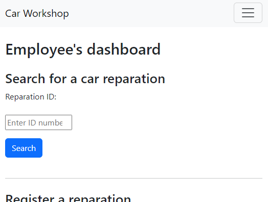

# Car Workshop project

This is an application to manage and see car reparations from workshops.



## Features

- Authenticate as a _workshop employee_ or _client_.
- Upload images.
- Get information from client's reparations.
- Mask sensitive information to any user except for the _employees_.

## Technologies used

### Requirements

- Composer
- PHP **^8.2**
- MariaDB **10.4.28** (MySQL)

### Dependencies

- Bootstrap **5.3.3**
- Monolog **^3.8**
- Intervention Image **^3.9.1**
- Ramsey UUID **^4.7**

## Installation

Follow the following steps to setup the app for developement.

1. Clone the repoository:

  ```bash
    git clone https://github.com/HodeonArtz/car-reparations-app.git
    cd ./car-reparations-app
  ```

2. Install dependencies:

  ```bash
    composer install
  ```

3. Configure your MySQL database connection in the file `/cfg/db_config.ini`:

  ```ini
  [mysqlconf]
  host=127.0.0.1 ; IP or domain name
  port=3306 ; connection port
  user=root ; MySQL server user name
  password= ; MySQL server user password
  db_name=car_workshop ; MySQL database name
  ```

4. Execute `/database-creation.sql` to setup database and table:

  ```sql
    create database if not exists car_workshop;
    use car_workshop;
    create table if not exists reparations(
      id int(4) primary key not null auto_increment,
        uuid char(36) not null,
        workshop_name varchar(12) not null,
        register_date date not null default CURRENT_TIMESTAMP(),
        license_plate char(8) not null,
        vehicle_image mediumblob not null
    );
  ```

5. Set configuration for image uploading in `/cfg/img_config.json`:

  ```json
  {
    "maxImgBytesSize": 6000000,
    "validMimeFormats": ["image/jpeg", "image/png", "image/webp"]
  }
  ```

6. Finally, open and start your project on your preferred web server.
